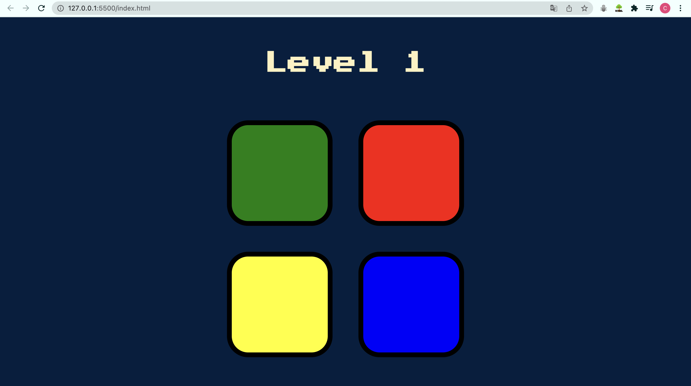

# The Simon Game

This is a solution The Simon Game. A challenge from The Complete 2022 Web Development Bootcamp, [Udemy course](https://www.udemy.com/course/the-complete-web-development-bootcamp/) of Dr. Angela Yu.

## Table of contents

- [Overview](#overview)
  - [The challenge](#the-challenge)
  - [Screenshot](#screenshot)
  - [Links](#links)
- [My process](#my-process)
  - [Built with](#built-with)
  - [What I learned](#what-i-learned)
  - [Continued development](#continued-development)
- [Author](#author)

## Overview

### The challenge

Firstly, the game shows the first colour in the sequence (blue). The user clicks on the blue button.

Next, the game shows the next colour (red), the user has to remember the sequence is blue, red and so on and so forth.

If the user messes up the sequence, then the game ends.

### Screenshot

### Links

- [Solution URL](https://github.com/claurey/simon-game)
- [Live Site URL](https://claurey.github.io/simon-game)

## My process

### Built with

- Semantic HTML5 markup
- CSS custom properties
- Javascript
- jQuery

### What I learned

I learned to use jQuery.

## Author

- Website - [https://claurey.github.io](https://claurey.github.io)
- Twitter - [@claurey591](https://www.twitter.com/claurey591)

